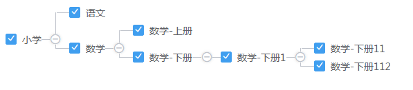

# vue-authtree
vue-authtree是一款基于vue实现的权限树插件，它与一般的权限树的不同之处在于，它是横线排版，而大多数权限树都是纵向排版。效果如图：

未全部选中：

 

全部选中：

 
# demo

# 使用
将src/components/vue-authtree组件拷贝至自己的项目中即可！(￣^￣゜)
# 组件props
## treeData
权限树数据，数据类型需为`Array`，数据结构如下：
```
[
  {
    text: "小学", // 显示的文字
    value: "primarySchool", // checkbox的值
    name: "primary_school", // checkbox的name属性值
    checked: false, // checkbox是否选中
    disabled: false, // checkbox是否禁用
    readonly: false, // checkbox是否只读
    children: [ // 子节点
      {
        text: "语文",
        value: "language",
        name: "primary_school",
        checked: true,
        disabled: false,
        readonly: false
      },
      {
        text: "数学",
        value: "mathematics",
        name: "primary_school",
        checked: false,
        disabled: false,
        readonly: false
      }
    ]
  }
]
```
## expand
节点是否默认全部展开，数据类型需为`Boolean`，默认为false。
## expandLevel
节点默认展开层级，超过该层级则不展开（此参数只在expand为true时有效）。数据类型需为`Number`，默认为-1，即不做限制
## onexpand(itemData, expandNode)
节点展开事件，如果该事件返回值为false则该节点不会进行展开/收缩。
+ `itemData`: 当前节点的数据
+ `expandNode`：一个函数，调用该函数并且传递true，则可以将当前节点展开，传递false则可以将该节点收缩。
## onchange(itemData, componentVM)
节点change事件，即选中或不选中事件
+ `itemData`: 当前节点的数据
+ `componentVM`：当前组件实例
## onTextClick(itemData, componentVM)
节点文字点击事件
+ `itemData`: 当前节点的数据
+ `componentVM`：当前组件实例
# 组件方法
## getCheckedNodes(excludeDisabled, excludeReadonly)
获取所有选中的节点，返回值为一个包含所有选中节点的数组
>参数介绍
+ `excludeDisabled`：是否排除禁用项，如果值为true，则返回的节点中不会包含已经排除的
+ `excludeReadonly`：是否排除只读项，如果值为true，则返回的节点中不会包含只读的
## getCheckedValues(excludeDisabled, excludeReadonly)
获取所有选中的节点的值，返回值为一个包含所有选中节点的值的数组。
>参数介绍
+ `excludeDisabled`：是否排除禁用项，如果值为true，则返回的值中不会包含已经排除的
+ `excludeReadonly`：是否排除只读项，如果值为true，则返回的值中不会包含只读的